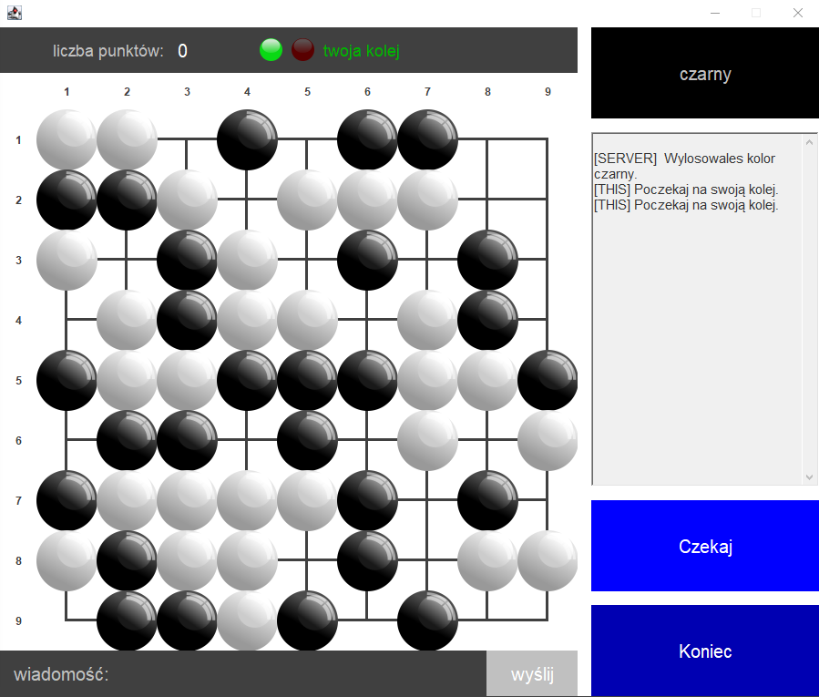

# Go Game | 2020

## Spis treści
- [O projekcie](#o-projekcie)
- [Wykorzystane narzędzia](#wykorzystane-narzędzia)
- [Silnik gry](#silnik-gry)
- [Gra z innym graczem](#gra-z-innym-graczem)
- [Gra z botem](#gra-z-botem)
- [Zapis stanu rozgrywki](#zapis-stanu-rozgrywki)
- [Testy jednostkowe](#testy-jednostkowe)

## O projekcie
Go Game to implementacja chińskiej gry go w całości napisana w Javie. Do wyboru użytkownik ma rozgrywkę z innym graczem lub z botem. Dodatkowo istnieje możliwość wyboru rozmiaru planszy. Aplikacja działa w technologii klient-serwer, dzięki czemu możliwe jest przeprowadzenie rozgrywki pomiędzy wieloma graczami na tym samym urządzeniu. Przebieg rozgrywki jest zapisywany w lokalnej bazie danych, a po jej zakończeniu możemy go odtworzyć.  
Zasady gry w Go można znaleźć [tutaj](https://pl.wikipedia.org/wiki/Zasady_go).  
  

## Wykorzystane narzędzia
* Java 8
* MySQL 8.0.22
* Hibernate 4.1.9

## Silnik gry
Go Game implementuje większość mechanizmów zawartych w zasadach gry w Go. Aplikacja uniemożliwia wykonanie niedozwolonego ruchu, w szczególności ruchu samobójczego, powtórzenia oraz ko. Gracz ma prawo zrezygnować z tury, kolejny pas dwóch graczy jest okazją do zakończenia rozgrywki i policzenia punktów.

## Gra z innym graczem
Jeśli podczas tworzenia nowej gry wybraliśmy tryb rozgrywki z innym graczem, serwer automatycznie tworzy nowy pokój. Zostajemy przekierowani do okna rozgrywki, gdzie oczekujemy na przeciwnika. Aby inny gracz został przekierowany do naszego pokoju, uruchamia on aplikację w trybie dołączania. Gra rozpoczyna się poprzez wylosowanie koloru dla obydwu graczy. Następnie gracze na zmianę stawiają piony na planszy, stosując ruchy dozwolone w instrukcji gry. Gra kończy się w momencie zapełnienia planszy lub rezygnacji któregoś z graczy. Po zakończonej rozgrywce zliczane są punkty, wliczając w to punkty za zbite piony oraz jeńców.

## Gra z botem
Jeśli utworzyliśmy nową rozgrywkę z botem, gra rozpoczyna się automatycznie. Tak jak w trybie rozgrywki z innym graczem, przed przystąpieniem do rozgrywki losowane są kolory dla gracza oraz bota. W swojej turze bot dokonuje ruchu lokalnie optymalnego. Priorytetem jest uniemożliwienie graczowi zbicia pionów bota. W dalszej kolejności bot szuka okazji do zbicia jak największej liczby pionów gracza, a jeśli taka okazja nie istnieje dokonuje ruchu który najwcześniej umożliwi taką okazję w przyszłości.  
**Uwaga!** W przeciwieństwie do rozgrywki z innym graczem, bot nigdy się nie podda!  

## Zapis stanu rozgrywki
Każdorazowa rozgrywka jest zapisywana w lokalnej bazie danych przy użyciu MySQL. Aby odtworzyć zapisaną rozgrywkę należy w oknie menu wybrać opcję powtórka. Następnie z rozwijanej listy wybieramy interesującą nas rozgrywkę. Każda pozycja na liście posiada unikalne id, rozmiar planszy oraz datę i godzinę przeprowadzenia rozgrywki.

## Testy jednostkowe
Silnik gry został przetestowany pod kątem zgodności z zasadami gry w Go. Testy jednostkowe pokrywają wszystkie możliwe ruchy we względnych konfiguracjach pomiędzy pionami białymi i czarnymi. Przetestowane zostało również, czy obszar zbijanych pionów pokrywa się z rzeczywistością.
